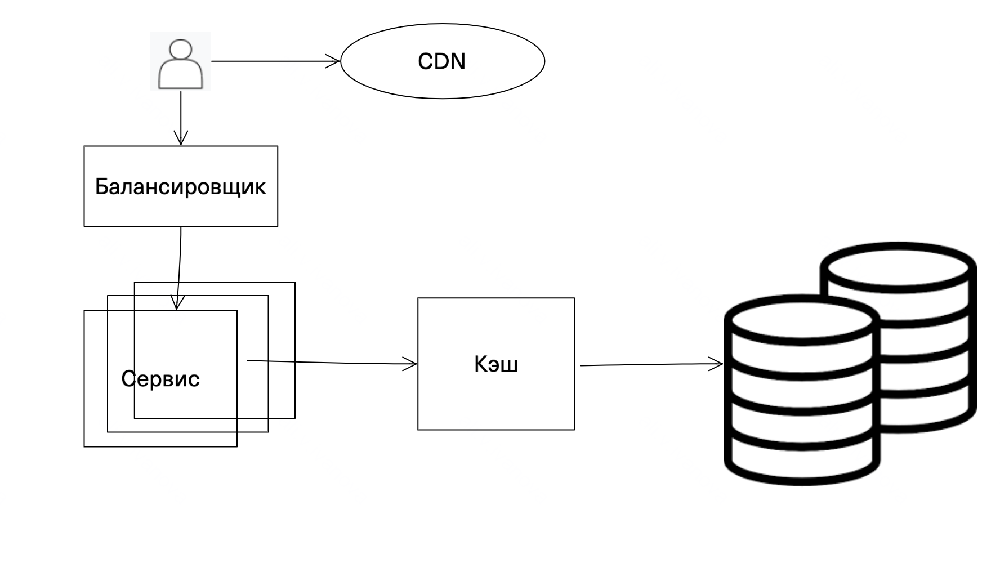

# Проектирование системы хранения данных и повышения производительности с использованием БД, кэша и CDN

## Цель:
Вам предстоит спроектировать систему хранения данных для высоконагруженного веб-приложения, которая сочетает реляционные или NoSQL базы данных, кэширование и Content Delivery Network (CDN). Задача заключается в создании архитектуры, которая обеспечивает высокую производительность, масштабируемость и надёжность при одновременной оптимизации затрат

### Выбор и проектирование базы данных

Реляционные базы данных подходят для хранения структурированных данных, там, где важна транзакционность и целостность данных,
а также для выполнения сложных запросов. 
Нереляционные базы данных подходят для хранения неструктурированных данных, легко горизонтально масштабируююутся 
и как правило поддерживают шардирование из коробки.

Построим схему базы данных (реляционной или NoSQL) для хранения информации, включающей данные пользователей, транзакции, и данные для аналитики.

Для хранения данных пользователей и транзакции будем использовать реляционную БД, н-р PostgreSQL.

Таблица пользователей
```
  CREATE TABLE users (
  user_id INT PRIMARY KEY,
  username VARCHAR(50) UNIQUE NOT NULL,
  email VARCHAR(100) UNIQUE NOT NULL,
  password_hash VARCHAR(255) NOT NULL,
  created_at TIMESTAMP DEFAULT CURRENT_TIMESTAMP
  );
```

Таблица транзакций
```
CREATE TABLE transactions (
transaction_id INT PRIMARY KEY,
user_id INT NOT NULL,
amount DECIMAL(15, 2) NOT NULL,
transaction_type VARCHAR(50) NOT NULL,
transaction_date TIMESTAMP DEFAULT CURRENT_TIMESTAMP
);
```

Для данных аналитики будем использовать NoSql, н-р MongoDB.

```
{
"user_id": 1,
"transaction_id": 101,
"amount": 250.75,
"transaction_type": "debit",
"transaction_date": "2025-03-15T12:00:00Z"
}
```

Для улучшения отказоустойчивости и доступности БД добавим репликацию. 
Для данных пользователей и транзакций выберем синхронную репликацию, т.к. при этом ниже риск потери данных, в то время как данные о транзакциях как правило имеют критическую важность и не стоит допускать их потери.
Для аналитики - асинхронную репликацию, т.к. критичность данных ниже, а асинхронная репликация увеличит производительность и масштабируемость.

Для большей доступности предусмотрим шардирование - для таблицы transactions по хэш transaction_id,
для users - по хэш userId. 

### Проектирование системы кэширования

Определим объекты для кэширования:
Пользовательские сессии и результаты сложных вычислений - в Redis. Настроим TTL для сессий в 15 минут, 
после чего данные из кэша будут удалены, а при повторном запросе - установлены заново. 
Результаты вычислений будем хранить 2 часа. При записи новых данных будем инвалидировать кэш. При чтении - будем брать данные из кэша.

Минимизируем неконсистентность данных с помощью паттерна Write-Through. Он гарантирует, что данные сначала записываются в базу данных, а затем кэшируются. В этом случае кэш всегда синхронизирован с базой данных.

### Интеграция CDN

 Статический контент, картинки и видео часто запрашиваемых страниц будем кэшировать в CDN.
 CDN использует множество точек присутствия по всему миру. Это позволяет размещать копии контента ближе к конечным пользователям, сокращая расстояние между сервером и клиентом.
 CDN кэширует часто запрашиваемые ресурсы (например, изображения, стили CSS, скрипты JavaScript) на своих серверах. Это позволяет быстро отвечать на запросы без необходимости обращаться к исходному серверу.
 Когда пользователь запрашивает веб-страницу, CDN кэширует статические ресурсы на ближайшем сервере, и последующие запросы к этим ресурсам обрабатываются мгновенно.
 CDN распределяет запросы между различными серверами, что предотвращает перегрузку отдельных серверов и обеспечивает стабильную работу системы.
 При отказе одного сервера запросы автоматически перенаправляются на другие доступные серверы, что повышает отказоустойчивость.
 
Общая схема:


### Работа с требованиями системы

Наша архитектура учитывает требования к согласованности, доступности и производительности. 
Это достигается следующим образом:
- Балансировщик равномерно распределяет запросы между веб-серверами для обеспечения равномерной нагрузки
- Кешрование с Redis хранит часто запрашиваемые данные для ускорения доступа и обеспечивает согласованность данных за счет обновления и инвалидации кэша
- Репликация и шардирование БД обеспечивает высокую доступность, отказоустойчивость, распределение нагрузки
- CDN доставляет статические данные ближе к пользователям, что увеличивает доступность

### Мониторинг и отладка

БД:
- Время выполнения запросов
- Количество запросов, поступающих в базу данных за единицу времени
- Общий размер базы данных

Кэш:
- Количество успешных обращений к кэшу
- Количество промахов
- Скорость кэширования

CDN:
- Время отклика
- Среднее время загрузки
- Скорость доставки
